# Free-form Prompt Box UX Enhancements

## Summary

1. **Both modes** generate on landing page, then navigate to canvas when complete (unified flow)
2. **Free-form (选择具体图示):** Rainbow glowing animation, ElButton loading, `diagram_type: null` (AI infers)
3. **Specific diagram (e.g. 气泡图):** Fix on that diagram type—pass `diagram_type` to API so backend enforces it (no AI override)
4. Replace send button with Element Plus `ElButton` with loading state for both modes

## Current vs New Flow

```mermaid
flowchart TD
    subgraph current [Current Flow]
        A1[User submits] --> B1[Navigate to canvas immediately]
        B1 --> C1[Canvas shows loading]
        C1 --> D1[API call from CanvasPage]
        D1 --> E1[Diagram appears]
    end

    subgraph new [New Flow - Unified]
        A2[User submits] --> B2[Stay on landing page]
        B2 --> C2[Rainbow animation if free-form]
        C2 --> D2[API call from DiagramTemplateInput]
        D2 --> E2[Load spec into diagramStore]
        E2 --> F2[Navigate to canvas]
        F2 --> G2[Diagram already loaded]
    end
```




**Diagram type handling:**

- **Free-form:** `diagram_type: null` → backend infers from prompt
- **Specific:** `diagram_type: "bubble_map"` (or selected type) → backend uses `forced_diagram_type`, never overrides

The backend ([agents/core/workflow.py](agents/core/workflow.py)) already respects `forced_diagram_type` for specific diagram.

### Prompt System Verification (CRITICAL)

**Verified:** The prompt system is centralized in `prompts/` and used correctly.


| Component               | Purpose                                    | Source                                                   |
| ----------------------- | ------------------------------------------ | -------------------------------------------------------- |
| **Classification**      | Diagram type detection (free-form)         | `prompts/main_agent.py` → CLASSIFICATION_EN/ZH           |
| **Topic extraction**    | Extract topic from prompt                  | `prompts/main_agent.py` → TOPIC_EXTRACTION_EN/ZH         |
| **Per-type generation** | Full spec for each diagram type            | `prompts/thinking_maps.py`, `prompts/mind_maps.py`, etc. |
| **prompt_to_diagram**   | Single-call full spec (used by PNG export) | `prompts/prompt_to_diagram_agent.py`                     |


**BUG FOUND:** When `diagram_type=null` (free-form), the workflow in [agents/core/workflow.py](agents/core/workflow.py) (lines 367–456) returns early with `use_default_template: True` and **no spec**. The frontend expects `result.spec` and would fail. This must be fixed.

**Backend fix required:** Remove the early return at lines 450–456. After diagram type detection, continue to the full generation block (`_generate_spec_with_agent`) instead of returning `use_default_template`. The detected `diagram_type` is already set; the generation block will use it.

## Implementation Plan

### 1. DiagramTemplateInput.vue - Core Changes

**File:** [frontend/src/components/mindgraph/DiagramTemplateInput.vue](frontend/src/components/mindgraph/DiagramTemplateInput.vue)

**A. Unified submit logic (both modes):**

- Both free-form and specific diagram use `generateFromLanding()`—no more emit + navigate for specific type
- **Free-form:** `diagram_type: null` → AI infers
- **Specific:** `diagram_type: diagramTypeMap[selectedType]` → backend fixes on that type (forced_diagram_type)

**B. Add state and API call:**

- Add `isGenerating` ref (used for both modes)
- Add `generateFromLanding()` async function that:
  - For free-form: `diagram_type: null`
  - For specific: `diagram_type: diagramTypeMap[selectedType.value]` (e.g. `bubble_map`)
  - Calls `authFetch('/api/generate_graph', { prompt, diagram_type, language, llm })`
  - On success: `diagramStore.loadFromSpec(result.spec, result.diagram_type)`, then `router.push('/canvas')`
  - On error: notify user, reset `isGenerating`
  - Use same validation (MAX_PROMPT_LENGTH 10000) as CanvasPage

**C. Update handleSubmit:**

```javascript
// Both modes: generate on landing, navigate when done
await generateFromLanding()
```

**D. Rainbow animation (when free-form + isGenerating):**

- Wrap the prompt box in a container with class when `selectedType === '选择具体图示' && isGenerating`
- Use CSS: rotating conic-gradient border or animated gradient that "travels" around the box
- Technique: pseudo-element with `conic-gradient(from 0deg, red, orange, yellow, green, blue, violet, red)` and `animation: rotate` (or `@property` + `@keyframes` for smooth gradient shift)
- Fallback: `linear-gradient` with `background-position` animation for broader browser support

**E. Replace send button with ElButton:**

- Import `ElButton` from element-plus
- Replace the native `<button>` with `<ElButton :loading="isGenerating" :disabled="..." @click="handleSubmit">`
- Both modes show loading during generation (API call takes several seconds)
- Keep ArrowRight icon; ElButton shows spinner when loading

### 2. CanvasPage.vue - Remove Landing Generation Flow

**File:** [frontend/src/pages/CanvasPage.vue](frontend/src/pages/CanvasPage.vue)

- **Remove** `canvas:generate_with_prompt` listener and `autoGenerateDiagram`—all generation now happens on landing
- **Remove** `customPrompt` ref and related logic
- When canvas mounts with `diagramStore.data` already populated (from landing pre-load), it displays immediately—existing logic already handles this
- The loading overlay (`isGenerating && !diagramStore.data`) is no longer needed for this flow; can be removed or kept for other edge cases (e.g. direct URL with type but no diagram)

### 3. Rainbow Animation CSS (Reference)

The "traveling" rainbow effect can be achieved with:

```css
/* Wrapper when generating */
.prompt-box-rainbow {
  position: relative;
  border-radius: inherit;
}
.prompt-box-rainbow::before {
  content: '';
  position: absolute;
  inset: -3px;
  border-radius: inherit;
  padding: 3px;
  background: conic-gradient(from var(--angle, 0deg), 
    red, orange, yellow, green, cyan, blue, violet, red);
  -webkit-mask: linear-gradient(#fff 0 0) content-box, linear-gradient(#fff 0 0);
  mask: linear-gradient(#fff 0 0) content-box, linear-gradient(#fff 0 0);
  -webkit-mask-composite: xor;
  mask-composite: exclude;
  animation: rainbowRotate 2s linear infinite;
}
@keyframes rainbowRotate {
  to { --angle: 360deg; }
}
```

Note: `@property --angle` may be needed for `conic-gradient` rotation in some browsers. Alternative: use a rotating wrapper with `transform: rotate()` on the gradient element.

### 4. Backend Fix - workflow.py (Required for free-form)

**File:** [agents/core/workflow.py](agents/core/workflow.py)

**Remove the early return** (lines 367–456) that returns `use_default_template` when `forced_diagram_type` is None. Instead, let the flow continue to the generation block:

- Delete the entire `if not forced_diagram_type:` block that does topic extraction and returns early
- The generation block uses `diagram_type` (from detection when free-form, or from forced_diagram_type when specific)
- Result: both free-form and specific diagram will receive a full `spec` in the API response

### 5. Files to Modify


| File                                                                                   | Changes                                                                                                                                                        |
| -------------------------------------------------------------------------------------- | -------------------------------------------------------------------------------------------------------------------------------------------------------------- |
| [DiagramTemplateInput.vue](frontend/src/components/mindgraph/DiagramTemplateInput.vue) | Unified `generateFromLanding` for both modes, `isGenerating`, rainbow wrapper (free-form only), ElButton with loading, pass fixed `diagram_type` when specific |
| [CanvasPage.vue](frontend/src/pages/CanvasPage.vue)                                    | Remove `canvas:generate_with_prompt` listener, `autoGenerateDiagram`, `customPrompt`; remove loading overlay used for that flow                                |
| [agents/core/workflow.py](agents/core/workflow.py)                                     | Remove early return for free-form; continue to full spec generation so API returns `spec`                                                                      |


### 6. Archive Reference

The archive [editor.html](archive/templates/editor.html) (lines 292-311) shows:

- Single prompt input with placeholder "Describe your diagram or choose from templates below..."
- Send button (`prompt-send-btn`)
- Diagram gallery below for template selection

The archive's `prompt-manager.js` and `diagram-selector.js` are referenced but not present in the repo. The described flow (generate on landing, then jump to canvas when complete) aligns with a typical "submit → wait → show result" UX and matches the user's request.