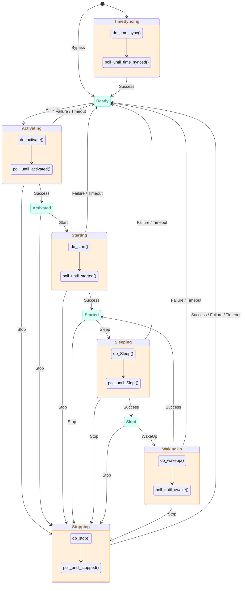

# ESP-Brookesia Agent Manager

* [中文版本](./README_CN.md)

## Overview

`brookesia_agent_manager` is an agent management framework for the ESP-Brookesia ecosystem, providing:

- **Unified Agent Lifecycle Management**: Centralized management of agent initialization, activation, start, stop, sleep, and wakeup through plugin mechanism, supporting dynamic switching between agents.
- **State Machine Management**: Automatic management of agent state transitions based on state machine, ensuring correctness and consistency of state transitions.
- **Agent Operation Control**: Supports agent operations such as suspend/resume, interrupt speaking, state querying, providing complete agent control capabilities.
- **Chat Mode Support**: Supports RealTime and Manual chat modes, with manual start/stop listening control in Manual mode.
- **Event-Driven Architecture**: Supports general action events, state change events, speaking/listening status events, text interaction events, and emote events, enabling decoupled communication between agents and applications.
- **Feature Extension Support**: Supports extension features such as function calling, text processing, interrupt speaking, and emotes, flexibly enabled through agent attribute configuration.
- **AFE Event Processing**: Optional AFE (Audio Front End) event processing, automatically responding to wake start/end events.
- **Service Integration**: Based on `brookesia_service_manager` framework, provides unified service interfaces, integrating Audio service and SNTP service.
- **Persistent Storage**: Optionally integrates with `brookesia_service_nvs` service for persistent storage of agent activation state, chat mode, and other information.

## Table of Contents

- [ESP-Brookesia Agent Manager](#esp-brookesia-agent-manager)
  - [Overview](#overview)
  - [Table of Contents](#table-of-contents)
  - [State Machine Architecture](#state-machine-architecture)
    - [State Machine Diagram](#state-machine-diagram)
    - [State Descriptions](#state-descriptions)
  - [API Reference](#api-reference)
    - [Chat Modes](#chat-modes)
    - [Function Interfaces](#function-interfaces)
    - [Event Interfaces](#event-interfaces)
  - [How to Use](#how-to-use)
    - [Development Environment Requirements](#development-environment-requirements)
    - [Adding to Project](#adding-to-project)
  - [FAQ](#faq)
    - [Audio service `PlayUrl` function behaves abnormally after agent executes Stop/Deactivate operation](#audio-service-playurl-function-behaves-abnormally-after-agent-executes-stopdeactivate-operation)

## State Machine Architecture

`brookesia_agent_manager` uses a state machine to manage agent lifecycle, ensuring correctness and consistency of state transitions.

### State Machine Diagram



### State Descriptions

| State | Type | Description |
|-------|------|-------------|
| **TimeSyncing** | Transient | Synchronizing time, waiting for time synchronization completion event |
| **Ready** | Stable | Ready state, time synchronized (or bypassed), waiting for activation command |
| **Activating** | Transient | Activating agent, waiting for activation completion event |
| **Activated** | Stable | Agent activated, waiting for start command |
| **Starting** | Transient | Starting agent, waiting for start completion event |
| **Started** | Stable | Agent started, can receive audio input and output |
| **Sleeping** | Transient | Putting agent to sleep, waiting for sleep completion event |
| **Slept** | Stable | Agent slept, can be woken up or stopped |
| **WakingUp** | Transient | Waking up agent, waiting for wakeup completion event |
| **Stopping** | Transient | Stopping agent, waiting for stop completion event |

## API Reference

### Chat Modes

The agent manager supports two chat modes:

| Mode | Description |
|------|-------------|
| **RealTime** | Real-time chat mode (default), agent automatically listens and responds to voice input |
| **Manual** | Manual chat mode, requires manual control of listening via `ManualStartListening` and `ManualStopListening` |

### Function Interfaces

| Function | Description | Parameters |
|----------|-------------|------------|
| `SetAgentInfo` | Set agent information | `Name`: Agent name, `Info`: Information object |
| `SetChatMode` | Set chat mode | `Mode`: `RealTime` or `Manual` |
| `ActivateAgent` | Activate agent | `Name`: Agent name (optional) |
| `GetAgentAttributes` | Get agent attributes | `Name`: Agent name (optional, returns all if empty) |
| `GetChatMode` | Get current chat mode | None |
| `GetActiveAgent` | Get currently active agent | None |
| `TriggerGeneralAction` | Trigger general action | `Action`: `Activate`/`Start`/`Stop`/`Sleep`/`WakeUp` |
| `Suspend` | Suspend agent | None |
| `Resume` | Resume agent | None |
| `InterruptSpeaking` | Interrupt speaking | None |
| `ManualStartListening` | Manually start listening (Manual mode only) | None |
| `ManualStopListening` | Manually stop listening (Manual mode only) | None |
| `GetGeneralState` | Get general state | None |
| `GetSuspendStatus` | Get suspend status | None |
| `GetSpeakingStatus` | Get speaking status | None |
| `GetListeningStatus` | Get listening status | None |
| `ResetData` | Reset data | None |

### Event Interfaces

| Event | Description | Parameters |
|-------|-------------|------------|
| `GeneralActionTriggered` | General action triggered | `Action`: Triggered action |
| `GeneralEventHappened` | General event happened | `Event`: Event type, `IsUnexpected`: Whether unexpected |
| `SuspendStatusChanged` | Suspend status changed | `IsSuspended`: Whether suspended |
| `SpeakingStatusChanged` | Speaking status changed | `IsSpeaking`: Whether speaking |
| `ListeningStatusChanged` | Listening status changed | `IsListening`: Whether listening |
| `AgentSpeakingTextGot` | Agent speaking text received | `Text`: Text content |
| `UserSpeakingTextGot` | User speaking text received | `Text`: Text content |
| `EmoteGot` | Emote event | `Emote`: Emote content |

## How to Use

### Development Environment Requirements

Before using this library, please ensure the following SDK development environment is installed:

- [ESP-IDF](https://github.com/espressif/esp-idf): `>=5.5,<6`

> [!NOTE]
> For SDK installation instructions, please refer to [ESP-IDF Programming Guide - Installation](https://docs.espressif.com/projects/esp-idf/en/latest/esp32/get-started/index.html#get-started-how-to-get-esp-idf)

### Adding to Project

`brookesia_agent_manager` has been uploaded to the [Espressif Component Registry](https://components.espressif.com/). You can add it to your project in the following ways:

1. **Using Command Line**

   Run the following command in your project directory:

   ```bash
   idf.py add-dependency "espressif/brookesia_agent_manager"
   ```

2. **Modify Configuration File**

   Create or modify the *idf_component.yml* file in your project directory:

   ```yaml
   dependencies:
     espressif/brookesia_agent_manager: "*"
   ```

For detailed instructions, please refer to [Espressif Documentation - IDF Component Manager](https://docs.espressif.com/projects/esp-idf/en/latest/esp32/api-guides/tools/idf-component-manager.html).

## FAQ

### Audio service `PlayUrl` function behaves abnormally after agent executes Stop/Deactivate operation

- This issue originates from the dependency component `jason-mao/av_processor`, and the developer is aware of it and working on a fix.
