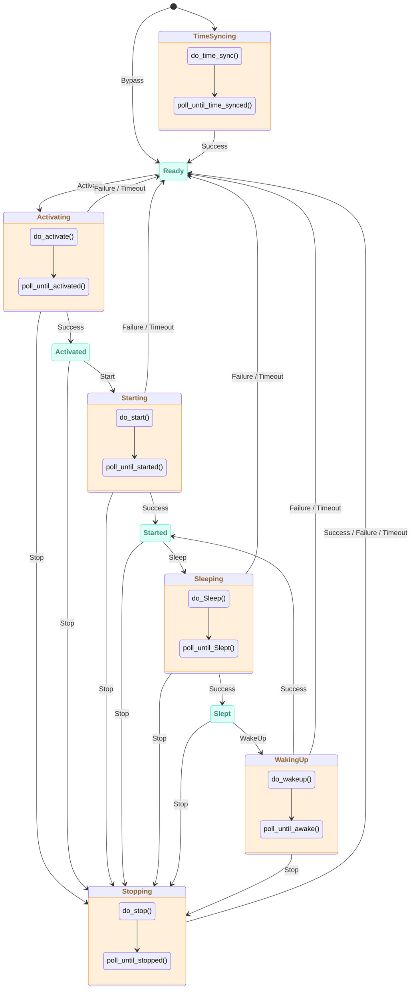

# ESP-Brookesia Agent Manager

* [English Version](./README.md)

## 概述

`brookesia_agent_manager` 是为 ESP-Brookesia 生态系统提供的智能体管理框架，提供：

- **统一的智能体生命周期管理**：通过插件机制，集中式管理智能体的初始化、激活、启动、停止、休眠和唤醒，支持智能体之间的动态切换。
- **状态机管理**：基于状态机自动管理智能体的状态转换，确保状态转换的正确性和一致性。
- **智能体操作控制**：支持智能体的暂停/恢复、中断说话、状态查询等操作，提供完整的智能体控制能力。
- **对话模式支持**：支持实时对话（RealTime）和手动对话（Manual）两种模式，手动模式下支持手动开始/停止监听。
- **事件驱动架构**：支持通用操作事件、状态变化事件、说话/监听状态事件、文本交互事件和表情事件，实现智能体与应用之间的解耦通信。
- **功能扩展支持**：支持函数调用、文本处理、中断说话、表情等扩展功能，通过智能体属性配置灵活启用。
- **AFE 事件处理**：可选启用 AFE（音频前端）事件处理，自动响应唤醒开始/结束事件。
- **服务集成**：基于 `brookesia_service_manager` 框架，提供统一的服务接口，集成音频服务和 SNTP 服务。
- **持久化存储**：可选搭配 `brookesia_service_nvs` 服务持久化保存智能体激活状态和对话模式等信息

## 目录

- [ESP-Brookesia Agent Manager](#esp-brookesia-agent-manager)
  - [概述](#概述)
  - [目录](#目录)
  - [状态机架构](#状态机架构)
    - [状态机图](#状态机图)
    - [状态说明](#状态说明)
  - [API 参考](#api-参考)
    - [对话模式](#对话模式)
    - [函数接口](#函数接口)
    - [事件接口](#事件接口)
  - [如何使用](#如何使用)
    - [开发环境要求](#开发环境要求)
    - [添加到工程](#添加到工程)
  - [常见问题](#常见问题)
    - [智能体执行 Stop 操作后，Audio 服务调用 `PlayUrl` 函数功能异常](#智能体执行-stop-操作后audio-服务调用-playurl-函数功能异常)

## 状态机架构

`brookesia_agent_manager` 使用状态机管理智能体的生命周期，确保状态转换的正确性和一致性。

### 状态机图



### 状态说明

| 状态 | 类型 | 说明 |
| ---- | ---- | ---- |
| **TimeSyncing** | 瞬态 | 正在同步时间，等待时间同步完成事件 |
| **Ready** | 稳定 | 就绪状态，时间已同步（或跳过），等待激活命令 |
| **Activating** | 瞬态 | 正在激活智能体，等待激活完成事件 |
| **Activated** | 稳定 | 智能体已激活，等待启动命令 |
| **Starting** | 瞬态 | 正在启动智能体，等待启动完成事件 |
| **Started** | 稳定 | 智能体已启动，可以接收音频输入和输出 |
| **Sleeping** | 瞬态 | 正在休眠智能体，等待休眠完成事件 |
| **Slept** | 稳定 | 智能体已休眠，可以唤醒或停止 |
| **WakingUp** | 瞬态 | 正在唤醒智能体，等待唤醒完成事件 |
| **Stopping** | 瞬态 | 正在停止智能体，等待停止完成事件 |

## API 参考

### 对话模式

智能体管理器支持两种对话模式：

| 模式 | 说明 |
| ---- | ---- |
| **RealTime** | 实时对话模式（默认），智能体自动监听和响应语音输入 |
| **Manual** | 手动对话模式，需要通过 `ManualStartListening` 和 `ManualStopListening` 手动控制监听 |

### 函数接口

| 函数名 | 说明 | 参数 |
| ------ | ---- | ---- |
| `SetAgentInfo` | 设置智能体信息 | `Name`: 智能体名称, `Info`: 信息对象 |
| `SetChatMode` | 设置对话模式 | `Mode`: `RealTime` 或 `Manual` |
| `ActivateAgent` | 激活智能体 | `Name`: 智能体名称（可选） |
| `GetAgentAttributes` | 获取智能体属性 | `Name`: 智能体名称（可选，为空返回所有） |
| `GetChatMode` | 获取当前对话模式 | 无 |
| `GetActiveAgent` | 获取当前激活的智能体 | 无 |
| `TriggerGeneralAction` | 触发通用操作 | `Action`: `Activate`/`Start`/`Stop`/`Sleep`/`WakeUp` |
| `Suspend` | 暂停智能体 | 无 |
| `Resume` | 恢复智能体 | 无 |
| `InterruptSpeaking` | 中断说话 | 无 |
| `ManualStartListening` | 手动开始监听（仅 Manual 模式） | 无 |
| `ManualStopListening` | 手动停止监听（仅 Manual 模式） | 无 |
| `GetGeneralState` | 获取通用状态 | 无 |
| `GetSuspendStatus` | 获取暂停状态 | 无 |
| `GetSpeakingStatus` | 获取说话状态 | 无 |
| `GetListeningStatus` | 获取监听状态 | 无 |
| `ResetData` | 重置数据 | 无 |

### 事件接口

| 事件名 | 说明 | 参数 |
| ------ | ---- | ---- |
| `GeneralActionTriggered` | 通用操作触发 | `Action`: 触发的操作 |
| `GeneralEventHappened` | 通用事件发生 | `Event`: 事件类型, `IsUnexpected`: 是否意外发生 |
| `SuspendStatusChanged` | 暂停状态变化 | `IsSuspended`: 是否暂停 |
| `SpeakingStatusChanged` | 说话状态变化 | `IsSpeaking`: 是否正在说话 |
| `ListeningStatusChanged` | 监听状态变化 | `IsListening`: 是否正在监听 |
| `AgentSpeakingTextGot` | 智能体说话文本 | `Text`: 文本内容 |
| `UserSpeakingTextGot` | 用户说话文本 | `Text`: 文本内容 |
| `EmoteGot` | 表情事件 | `Emote`: 表情内容 |

## 如何使用

### 开发环境要求

使用本库前，请确保已安装以下 SDK 开发环境：

- [ESP-IDF](https://github.com/espressif/esp-idf): `>=5.5,<6`

> [!NOTE]
> SDK 的安装方法请参阅 [ESP-IDF 编程指南 - 安装](https://docs.espressif.com/projects/esp-idf/zh_CN/latest/esp32/get-started/index.html#get-started-how-to-get-esp-idf)

### 添加到工程

`brookesia_agent_manager` 已上传到 [Espressif 组件库](https://components.espressif.com/)，您可以通过以下方式将其添加到工程中：

1. **使用命令行**

    在工程目录下运行以下命令：

   ```bash
   idf.py add-dependency "espressif/brookesia_agent_manager"
   ```

2. **修改配置文件**

   在工程目录下创建或修改 *idf_component.yml* 文件：

   ```yaml
   dependencies:
     espressif/brookesia_agent_manager: "*"
   ```

详细说明请参阅 [Espressif 文档 - IDF 组件管理器](https://docs.espressif.com/projects/esp-idf/zh_CN/latest/esp32/api-guides/tools/idf-component-manager.html)。

## 常见问题

### 智能体执行 Stop 操作后，Audio 服务调用 `PlayUrl` 函数功能异常

- 该问题源于依赖组件 `jason-mao/av_processor`，目前开发者已知悉并在修复中。
