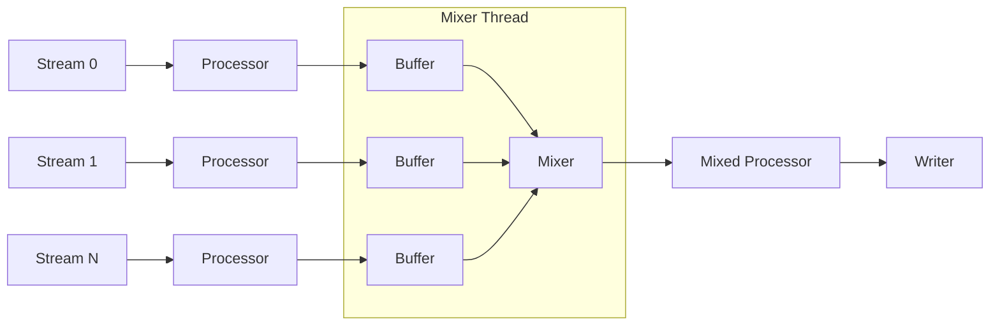
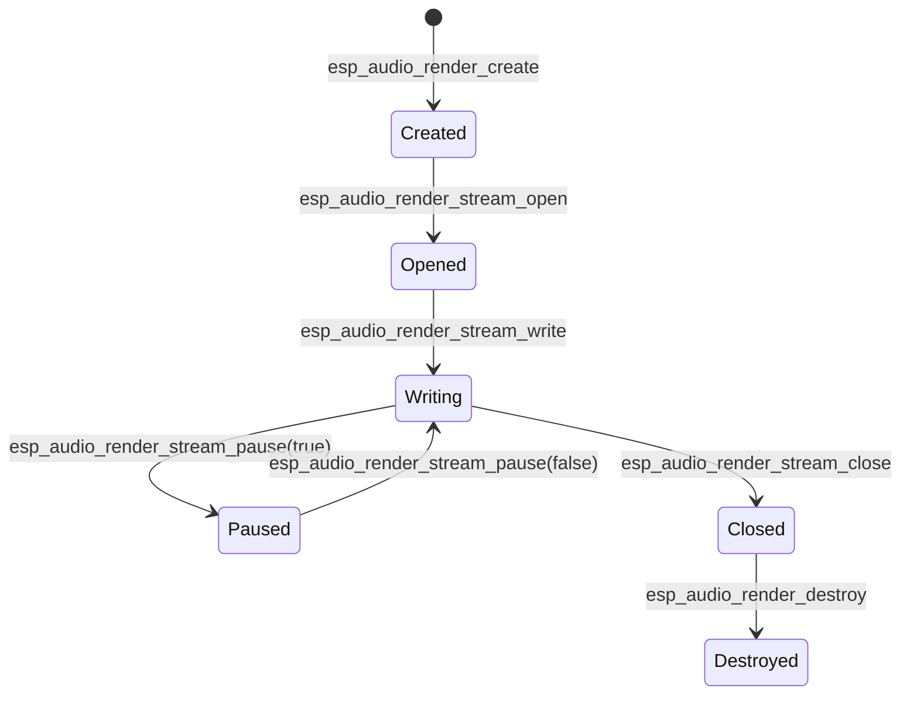

# ESP Audio Render

- [](https://components.espressif.com/components/espressif/esp_audio_render)
- [中文版](./README_CN.md)

ESP Audio Render is a high-level audio rendering component for Espressif SoCs.
It multiplexes one or more PCM input streams, applies optional audio processing via ESP-GMF pipelines (ALC, Sonic, EQ, etc.), and outputs through a user-defined writer callback.

---

## Glossary
- **Stream**: An individual PCM input to the renderer (e.g., music, TTS, notification).
- **Stream Processor**: Audio effect applied *before* mixing (e.g., Sonic speed change, EQ).
- **Mixed Processor**: Effect applied *after* mixing (e.g., ALC, limiter).
- **Element**: A GMF processing node that implements a function (EQ, Sonic, etc.).
- **Pool**: The memory/object pool used by GMF to create processors.
- **Writer**: User callback that receives final PCM data for playback (e.g., I2S, Bluetooth sink).

---

## Key Features
- Multiple input streams mixed into a single output
- Optional per-stream and/or mixed processing using ESP-GMF elements
- Flexible sink: Customizable through write callbacks
- Dynamic processor pipeline generation for optimization
- Advanced control like `pause`, `resume`, `flush`, `speed change`

---

## Architecture
### Single Stream
For one stream, processing (if any) is applied inline and the result is directly sent to the writer.


### Multiple Streams
In multi-stream mode, each stream has its own processor and buffer.
A mixer thread combines them, applies optional mixed-processing, and outputs via the writer.


---

## Configuration
Renderer is created with `esp_audio_render_cfg_t`.

| Field              | Description                                     | Required | Default |
|--------------------|-------------------------------------------------|----------|---------|
| `max_stream_num`   | Max number of streams (1 = no mixer, >1 = mixer)| ✅       | —       |
| `out_writer`       | Final PCM writer callback                       | ✅       | —       |
| `out_ctx`          | Context pointer for writer callback             | Optional | NULL    |
| `out_sample_info`  | Desired output format (must match sink)         | Optional | Dynamic change through `esp_audio_render_set_out_sample_info` |
| `pool`             | GMF pool handle (needed if using processors)    | Optional | NULL    |
| `process_period`   | Mixer process unit in ms (e.g. 20 ms)           | Optional | 20 ms   |

---

## Stream Lifecycle


Notes:
- **Destroy will automatically close all streams** - never call any render related API again
- After closing, a stream can be re-opened if needed.

---

## Typical Scenarios
- 🎵 **Single Stream Playback** – Decode and render one audio source (e.g., MP3, WAV).
- 📱 **TTS + Notification Mixing** – Mix voice prompts with system sounds.
- 🎧 **Background Music + Voice Chat** – Simultaneous playback, with optional ducking (lowering background music volume during voice).
- 🎹 **Music Generation (Auto-Generated Tracks)** – Example: a piano piece split into 4 tracks (melody, chords, pedal, percussion), mixed in real-time.

---

## Minimal Example
```c
#include "esp_audio_render.h"
#include "esp_gmf_pool.h"
#include "esp_codec_dev.h"

static int my_write(uint8_t *pcm, uint32_t len, void *ctx)
{
    esp_codec_dev_handle_t play_handle = ctx;
    esp_codec_dev_write(play_handle, pcm, len);
    return 0;
}

// Make sure codec device is opened and set to 48kHz, 2ch, 16bit
void example(esp_codec_dev_handle_t play_handle)
{
    esp_gmf_pool_handle_t pool = NULL;
    esp_gmf_pool_init(&pool);
    // Add your customized element into pool, or use esp-gmf loader

    esp_audio_render_cfg_t cfg = {
        .max_stream_num = 1,
        .out_writer = my_write,
        .out_ctx = play_handle,
        .out_sample_info = {
            .sample_rate = 48000,
            .channels = 2,
            .bits_per_sample = 16,
        },
        .pool = pool,
    };
    esp_audio_render_handle_t render = NULL;
    esp_audio_render_create(&cfg, &render);

    // Suppose input sample info is 16kHz, 2ch, 16bit
    esp_audio_render_sample_info_t in = {
        .sample_rate = 16000,
        .channels = 2,
        .bits_per_sample = 16,
    };
    esp_audio_render_stream_handle_t stream;
    esp_audio_render_stream_get(render, ESP_AUDIO_RENDER_FIRST_STREAM, &stream);
    esp_audio_render_stream_open(stream, &in);

    // Loop to feed data
    esp_audio_render_stream_write(stream, buf, len);

    esp_audio_render_stream_close(stream);
    esp_audio_render_destroy(render);
    esp_gmf_pool_deinit(pool);
}
```
For more detailed usage, take the example code [audio_render](examples/audio_render/) and [simple_piano](examples/simple_piano/) for reference.

---

## Best Practices
- Align PCM frame sizes with the configured process period (default 20 ms).
- In multi-stream mode, avoid underruns by ensuring all streams provide enough data.
- Use `esp_audio_render_stream_get_latency()` to monitor end-to-end buffering.
