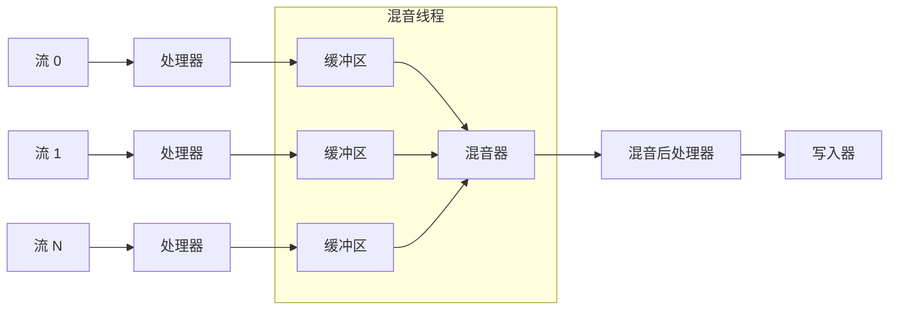
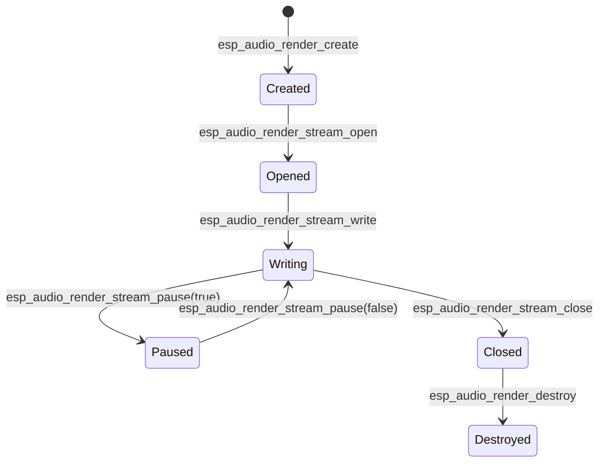

# ESP 音频渲染器

- [](https://components.espressif.com/components/espressif/esp_audio_render)
- [English](./README.md)

ESP 音频渲染器是专为乐鑫 SoC 设计的高级音频渲染组件。
它可以将一个或多个 PCM 输入流进行复用，通过 ESP-GMF 流水线应用可选的音频处理（如 ALC、Sonic、EQ 等），并通过用户定义的写入回调函数输出。

---

## 术语表
- **流（Stream）**：渲染器的单个 PCM 输入（例如：音乐、TTS、通知音）。
- **流处理器（Stream Processor）**：在混音*之前*应用的音频效果（例如：Sonic 速度变化、EQ）。
- **混音后处理器（Mixed Processor）**：在混音*之后*应用的效果（例如：ALC、限幅器）。
- **元素（Element）**：实现特定功能的 GMF 处理节点（如 EQ、Sonic 等）。
- **池（Pool）**：GMF 用于创建处理器的内存/对象池。
- **写入器（Writer）**：接收最终 PCM 数据进行播放的用户回调函数（例如：I2S、蓝牙接收器）。

---

## 主要特性
- 将多个输入流混音为单个输出
- 使用 ESP-GMF 元素进行可选的每流处理和/或混音后处理
- 灵活的接收端：通过写入回调函数自定义
- 动态处理器流水线生成以优化性能
- 高级控制功能，如 `pause`、`resume`、`flush`、`speed change`

---

## 架构
### 单流模式
对于单个流，处理（如果有的话）会内联应用，结果直接发送给写入器。


### 多流模式
在多流模式下，每个流都有自己的处理器和缓冲区。
混音线程将它们组合，应用可选的后期处理，并通过写入器输出。


---

## 配置
渲染器通过 `esp_audio_render_cfg_t` 创建。

| 字段                | 描述                                           | 必需     | 默认值   |
|---------------------|------------------------------------------------|----------|----------|
| `max_stream_num`    | 最大流数量（1 = 无混音器，>1 = 混音器）          | ✅       | —        |
| `out_writer`        | 最终 PCM 写入回调函数                           | ✅       | —        |
| `out_ctx`           | 写入回调函数的上下文指针                         | 可选     | NULL     |
| `out_sample_info`   | 期望的输出格式（必须与接收端匹配）                | 可选     | 可通过 `esp_audio_render_set_out_sample_info` 动态更改 |
| `pool`              | GMF 池句柄（使用处理器时需要）                    | 可选     | NULL     |
| `process_period`    | 混音处理帧大小（毫秒，例如 20 ms）                | 可选     | 20 ms    |

---

## 流生命周期


注意事项：
- **destroy 会自动关闭所有流** - 之后永远不要再调用任何渲染相关的 API
- 关闭后，如果需要，流可以重新打开。

---

## 典型应用场景
- 🎵 **单流播放** – 解码并渲染单个音频源（例如：MP3、WAV）。
- 📱 **TTS + 通知混音** – 将语音提示与系统声音混音。
- 🎧 **背景音乐 + 语音聊天** – 同时播放，可选择闪避功能（语音期间降低背景音乐音量）。
- 🎹 **音乐生成（自动生成音轨）** – 示例：将钢琴曲分为 4 个音轨（旋律、和弦、踏板、打击乐），实时混音。

---

## 最小示例
```c
#include "esp_audio_render.h"
#include "esp_gmf_pool.h"
#include "esp_codec_dev.h"

static int my_write(uint8_t *pcm, uint32_t len, void *ctx)
{
    esp_codec_dev_handle_t play_handle = ctx;
    esp_codec_dev_write(play_handle, pcm, len);
    return 0;
}

// 确保编解码器设备已打开并设置为 48kHz、2ch、16bit
void example(esp_codec_dev_handle_t play_handle)
{
    esp_gmf_pool_handle_t pool = NULL;
    esp_gmf_pool_init(&pool);
    // 将您的自定义元素添加到池中，或使用 esp-gmf 加载器

    esp_audio_render_cfg_t cfg = {
        .max_stream_num = 1,
        .out_writer = my_write,
        .out_ctx = play_handle,
        .out_sample_info = {
            .sample_rate = 48000,
            .channels = 2,
            .bits_per_sample = 16,
        },
        .pool = pool,
    };
    esp_audio_render_handle_t render = NULL;
    esp_audio_render_create(&cfg, &render);

    // 假设输入采样信息为 16kHz、2ch、16bit
    esp_audio_render_sample_info_t in = {
        .sample_rate = 16000,
        .channels = 2,
        .bits_per_sample = 16,
    };
    esp_audio_render_stream_handle_t stream;
    esp_audio_render_stream_get(render, ESP_AUDIO_RENDER_FIRST_STREAM, &stream);
    esp_audio_render_stream_open(stream, &in);

    // 循环提供数据
    esp_audio_render_stream_write(stream, buf, len);

    esp_audio_render_stream_close(stream);
    esp_audio_render_destroy(render);
    esp_gmf_pool_deinit(pool);
}
```
如需更详细的使用说明，请参考示例代码 [audio_render](examples/audio_render/) 和 [simple_piano](examples/simple_piano/)。

---

## 最佳实践
- 将 PCM 帧大小与配置的处理周期对齐（默认 20 ms）。
- 在多流模式下，通过确保所有流提供足够的数据来避免欠载。
- 使用 `esp_audio_render_stream_get_latency()` 监控端到端缓冲。
