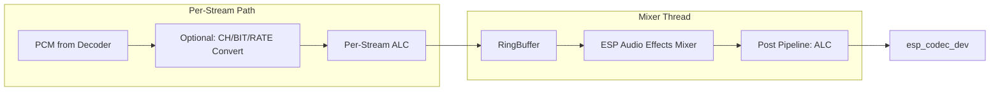

# ESP Audio Render Example

- [中文版](./README_CN.md)

This example demonstrates how to use `esp_audio_render` to render PCM audio with or without processing, and how to mix multiple inputs into one output. It shows end‑to‑end flow: fetch compressed audio (e.g., MP3) over network, decode it using `esp_audio_codec` decoder, feed PCM into the render API, and finally output to `esp_codec_dev` (I2S codec).

## Hardware Requirements

- Recommended: [ESP32-S3-Korvo2](https://docs.espressif.com/projects/esp-adf/en/latest/design-guide/dev-boards/user-guide-esp32-s3-korvo-2.html) or [ESP32‑P4‑Function‑EV‑Board](https://docs.espressif.com/projects/esp-dev-kits/en/latest/esp32p4/esp32-p4-function-ev-board/user_guide.html)
- Other boards are supported; see [Other Board Support](#other-board-support)

## Software Requirements

- ESP‑IDF v5.4 or later
- `esp_audio_render` component
- ESP‑GMF framework (to provide format converters and optional processors)
- `esp_audio_codec` (for decoding MP3/others)
- `esp_codec_dev` (for actual audio output)

## Features Demonstrated

- **Single‑stream playback**: MP3/AAC (HTTP) → decode to PCM → render → codec
- **Multi‑stream mixing**: Decode multiple independent MP3/AAC sources and mix to one sink
- **Fixed output format configuration**: 16 kHz, 16‑bit, stereo output
- **Per‑stream processing**: ALC (Automatic Level Control) on each stream
- **Post‑mix processing**: ALC processing after mixing
- **Network audio streaming**: HTTP-based MP3/AAC file download and playback

## How it works

### Overall flow


### Processor pipeline placement


- **Per‑stream processing** runs inline in the `esp_audio_render_stream_write()` caller
- **When `stream_num > 1`**, the mixer thread consumes per‑stream ring buffer and runs a post‑mix pipeline
- **ALC processing** is applied both per-stream and post-mix for demonstrating audio processor capabilities

## Running the example

1. Configure Wi‑Fi and board audio codec initialization in the example's `app_main()` (or corresponding helper), then build and flash:
```bash
idf.py -p /dev/XXXXX flash monitor
```

2. The example automatically runs two test scenarios:
   - **Single stream test**: Downloads and plays one MP3 file for 30 seconds
   - **Multi-stream mixing test**: Downloads and mixes 8 different audio sources simultaneously

### Typical API calls
- `esp_audio_render_create()` - Creates renderer with mutex initialization
- `esp_audio_render_set_out_sample_info()` - Sets output format
- `esp_audio_render_stream_open()` - Opens stream with mutex protection
- `esp_audio_render_stream_add_procs()` - Adds processors to streams
- `esp_audio_render_stream_write()` - Writes PCM data
- `esp_audio_render_stream_close()` - Closes stream with mutex protection
- `esp_audio_render_destroy()` - Cleans up with mutex destruction


## Other Board Support

This example can leverage `gmf_app_utils` for quick board bring‑up. Check board compatibility in menuconfig under "GMF APP Configuration." For details, see the `gmf_app_utils` README.

Alternatively, you can use [esp-bsp](https://github.com/espressif/esp-bsp/tree/master) APIs:
- Use `bsp_audio_codec_microphone_init()` to replace `esp_gmf_app_get_record_handle()`
