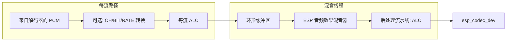

# ESP 音频渲染器示例

- [English](./README.md)

本示例演示了如何使用 `esp_audio_render` 来渲染带或不带音效处理的 PCM 音频，以及如何将多个输入混音为一个输出。它展示了端到端流程：通过网络获取压缩音频（例如 MP3），使用 `esp_audio_codec` 解码器解码，将 PCM 输入到渲染 API，最终输出到 `esp_codec_dev`（I2S 编解码器）。

## 硬件要求

- **推荐**：[ESP32-S3-Korvo2](https://docs.espressif.com/projects/esp-adf/en/latest/design-guide/dev-boards/user-guide-esp32-s3-korvo-2.html) 或 [ESP32‑P4‑Function‑EV‑Board](https://docs.espressif.com/projects/esp-dev-kits/en/latest/esp32p4/esp32-p4-function-ev-board/user_guide.html)
- 支持其他开发板；请参阅 [其他开发板支持](#其他开发板支持)

## 软件要求

- ESP‑IDF v5.4 或更高版本
- `esp_audio_render` 组件
- ESP‑GMF 框架（提供格式转换器和可选处理器）
- `esp_audio_codec`（用于解码 MP3/其他格式）
- `esp_codec_dev`（用于实际音频输出）

## 演示的功能特性

- **单流播放**：MP3/AAC (HTTP) → 解码为 PCM → 渲染 → 编解码器
- **多流混音**：解码多个独立的 MP3/AAC 源并混音到一个接收端
- **固定输出格式配置**：16 kHz、16位、立体声输出
- **每流处理**：每个流上的 ALC（自动电平控制）
- **混音后处理**：混音后的 ALC 处理
- **网络音频流**：基于 HTTP 的 MP3/AAC 文件下载和播放

## 工作原理

### 整体流程


### 处理器流水线布局


- **每流处理** 在 `esp_audio_render_stream_write()` 调用者中内联运行
- **当 `stream_num > 1` 时**，混音线程消费每流环形缓冲区并运行混音后流水线
- **ALC 处理** 在每流和混音后都应用，用于演示音频处理器功能

## 运行示例

1. 在示例的 `app_main()`（或相应的辅助函数）中配置 Wi‑Fi 和开发板音频编解码器初始化，然后构建和烧录：
```bash
idf.py -p /dev/XXXXX flash monitor
```

2. 该示例自动运行两个测试场景：
   - **单流测试**：下载并播放一个 MP3 文件 30 秒
   - **多流混音测试**：同时下载并混音 8 个不同的音频源

### 典型 API 调用
- `esp_audio_render_create()` - 创建渲染器并初始化互斥锁
- `esp_audio_render_set_out_sample_info()` - 设置输出格式
- `esp_audio_render_stream_open()` - 打开流并保护互斥锁
- `esp_audio_render_stream_add_procs()` - 向流添加处理器
- `esp_audio_render_stream_write()` - 写入 PCM 数据
- `esp_audio_render_stream_close()` - 关闭流并保护互斥锁
- `esp_audio_render_destroy()` - 清理并销毁互斥锁

## 其他开发板支持

本示例可以利用 `gmf_app_utils` 进行快速开发板启动。在menuconfig的"GMF APP Configuration"下检查开发板兼容性。详情请参阅 `gmf_app_utils` README。

或者，您可以使用 [esp-bsp](https://github.com/espressif/esp-bsp/tree/master) API：
- 使用 `bsp_audio_codec_microphone_init()` 替代 `esp_gmf_app_get_record_handle()`
