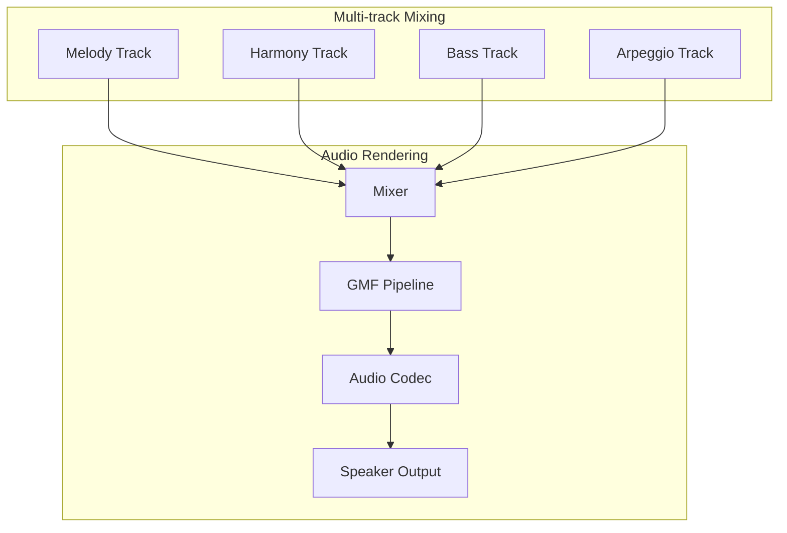

# Simple Piano Example
- [中文版](./README_CN.md)

This example demonstrates a complete **polyphonic piano synthesizer** using the `esp_audio_render` component. It showcases advanced audio generation, multi-track music composition, and real-time audio rendering capabilities.

## 🎹 **Features Demonstrated**

### **Core Audio Capabilities**
- **Multi-track Audio Rendering**: 4 independent audio streams (melody, harmony, bass, arpeggio)
- **Real-time Audio Generation**: 20ms chunk-based processing for smooth playback
- **Stream Management**: Independent stream control with proper lifecycle management

### **Advanced Piano Synthesis**
- **Harmonic-rich Piano Tones**: 4-harmonic synthesis (fundamental + 3 overtones)
- **ADSR Envelope**: Professional attack, decay, sustain, release shaping
- **Polyphonic Support**: Multiple notes playing simultaneously
- **Octave Range**: Support for octaves 2-7 (C2 to B7)
- **Optimized Performance**: Fast sine lookup tables with interpolation

### **Music Composition System**
- **Multi-track Composition**: Up to 4 independent musical tracks
- **Note-based Music**: C, D, E, F, G, A, B note system with durations
- **Tempo Control**: Configurable BPM and beat duration
- **Real-time Rendering**: Dynamic note generation and mixing

### **Real-time Piano Control** (Optional)
- **Interactive Piano Playing**: When `SUPPORT_REALTIME_TRACK` is enabled
- **UART Control Interface**: Real-time piano control via Python script
- **Press/Release Events**: Natural piano key press and release behavior
- **Multi-octave Support**: C3-B3 (low), C4-B4 (mid), C5-B5 (high) ranges
- **Live Performance**: Play piano in real-time through keyboard input

## 🏗️ **Architecture Overview**



## 🎵 **How It Works**

### **1. Music Definition**
The example defines a complete song ("Twinkle Twinkle Little Star") with 4 tracks:
- **Track 0 (Melody)**: Main tune in octave 4
- **Track 1 (Harmony)**: Chord accompaniment in octave 3-4
- **Track 2 (Bass)**: Low bass line in octave 2
- **Track 3 (Arpeggio)**: Broken chord patterns in octave 4-5

### **2. Real-time Note Generation**
```c
// Process in 20ms chunks for smooth audio
const uint32_t chunk_duration_ms = 20;
uint32_t pcm_size = (sample_rate * chunk_duration_ms / 1000) * channels * 2;

// Generate audio for each track independently
for (int track_idx = 0; track_idx < MAX_TRACKS; track_idx++) {
    // Generate note audio for current time position
    piano_tone_gen_note_from_offset(tone_gen, note, octave,
                                   chunk_duration_ms, buffer, buffer_size,
                                   note_elapsed, full_note_duration);
}
```

### **3. Real-time Audio Rendering**
Each of the generated track data is then fed into audio render streams using `esp_audio_render_stream_write`.

Audio render will mix all track data and finally output through codec devices.

### **4. Interactive Piano Control** (with SUPPORT_REALTIME_TRACK)
When real-time piano is enabled, the system can receive UART commands for live piano playing.

The Python controller (`piano_key.py`) provides:
- **Terminal-based input**: Raw keyboard capture without root permissions
- **Multi-octave support**: Different octaves for different key ranges

## 🚀 **Running the Example**

### **Hardware Requirements**
- **Recommended**: [ESP32-S3-Korvo2](https://docs.espressif.com/projects/esp-adf/en/latest/design-guide/dev-boards/user-guide-esp32-s3-korvo-2.html) or [ESP32‑P4‑Function‑EV‑Board](https://docs.espressif.com/projects/esp-dev-kits/en/latest/esp32p4/esp32-p4-function-ev-board/user_guide.html)
- **Audio Output**: Built-in speaker or headphone jack
- **Other boards**: Supported via `esp_gmf_app_setup_peripheral()`

### **Software Requirements**
- ESP‑IDF v5.4 or later
- `esp_audio_render` component
- ESP‑GMF framework (format converters)
- `esp_codec_dev` (audio output)

### **Build and Flash**
```bash
# Navigate to example directory
cd examples/simple_piano

# Build and flash
idf.py -p /dev/ttyUSB0 flash monitor
```

### **Enable Real-time Piano (Optional)**
To enable interactive piano control via UART:

1. **Rebuild after Enable the feature** in [piano_example.c](main/piano_example.c):
   ```bash
   #define SUPPORT_REALTIME_TRACK
   ```

2. **Use the Python controller** (in a separate terminal):
   ```bash
   # Install dependencies
   pip install pyserial
   
   # Run the piano controller
   python3 piano_key.py --port /dev/ttyUSB0 --baud 115200
   ```

3. **Play piano in real-time**:
   - **Numbers 1-7**: C4-B4 (mid octave)
   - **Letters Q-U**: C5-B5 (high octave) 
   - **ESC**: Stop piano
   - **Ctrl+C**: Exit controller

## 🔧 **Key API Usage**

### **Piano Tone Generation**
```c
// Create piano tone generator
piano_tone_cfg_t cfg = {
    .sample_rate = 16000,
    .channels = 1,
    .bits_per_sample = 16,
    .attack_time = 0.01f,    // 10ms attack
    .decay_time = 0.05f,     // 50ms decay
    .sustain_level = 0.7f,   // 70% sustain
    .release_time = 0.1f     // 100ms release
};
piano_tone_gen_create(&cfg, &tone_gen);

// Generate note audio
piano_tone_gen_note_from_offset(tone_gen, NOTE_C, OCTAVE_4,
                               20, buffer, buffer_size,
                               elapsed_time, full_duration);
```

### **Song Rendering**
```c
// Create song renderer
song_cfg_t song_cfg = {
    .sample_rate = 16000,
    .channels = 1,
    .bits_per_sample = 16,
    .track_count = 4,
    .tempo = 120,              // 120 BPM
    .beat_duration_ms = 500    // 500ms per beat
};
song_render_create(&song_cfg, &song);

// Add musical tracks
song_render_add_track(song, 0, melody_notes, melody_octaves,
                     melody_durations, note_count);

// Start playback
song_render_play(song, audio_render);
```

### **Audio Render Integration**
```c
// Create audio renderer
esp_audio_render_create(&cfg, &audio_render);

// Open multiple streams
esp_audio_render_stream_handle_t stream_handles[4];
for (int i = 0; i < 4; i++) {
   esp_audio_render_stream_get(render, ESP_AUDIO_RENDER_STREAM_ID(i), &stream_handles[i]);
}
esp_audio_render_stream_open(stream_handles[0], &input_info);  // Melody
esp_audio_render_stream_open(stream_handles[1], &input_info);  // Harmony
esp_audio_render_stream_open(stream_handles[2], &input_info);  // Bass
esp_audio_render_stream_open(stream_handles[3], &input_info);  // Arpeggio

// Write audio data continuously
esp_audio_render_stream_handle_t current_stream = NULL;
esp_audio_render_stream_get(render->audio_render, ESP_AUDIO_RENDER_STREAM_ID(track->track_id), &current_stream);
esp_audio_render_stream_write(current_stream, pcm_buffer, pcm_size);
```

## 🎼 **Music Theory Implementation**

### **Note System**
- **Western Scale**: C, D, E, F, G, A, B (Do, Re, Mi, Fa, Sol, La, Si)
- **Frequency Calculation**: `freq = base_freq * 2^(octave - 4)`
- **Base Frequencies**: C4 = 261.63 Hz, D4 = 293.66 Hz, etc.

### **Harmonic Synthesis**
Implemented in `generate_piano_wave`

### **ADSR Envelope**
Implemented in `calculate_adsr_envelope`

## 🎯 **Use Cases**

### **Educational Applications**
- **Music Theory Learning**: Note recognition and frequency relationships
- **Composition Practice**: Multi-track music creation
- **Audio Programming**: DSP and synthesis concepts

### **Product Development**
- **Audio Feedback**: System sounds and notifications
- **Music Players**: Embedded music synthesis
- **Interactive Audio**: Real-time audio generation
- **Live Music Performance**: Real-time piano playing and MIDI-like control

### **Testing and Validation**
- **Audio Pipeline Testing**: Multi-stream audio rendering
- **Performance Benchmarking**: Real-time audio generation
- **Format Conversion**: GMF pipeline validation

## Other Board Support

This example can leverage `gmf_app_utils` for quick board bring‑up. Check board compatibility in menuconfig under “GMF APP Configuration.” For details, see the `gmf_app_utils` README.

Alternatively, you can use [esp-bsp](https://github.com/espressif/esp-bsp/tree/master) APIs:
- Use `bsp_audio_codec_microphone_init()` to replace `esp_gmf_app_get_record_handle()`

## 🤝 **Contributing**

This example demonstrates best practices for:
- **Audio Synthesis**: Efficient tone generation algorithms
- **Multi-track Audio**: Independent stream management
- **Real-time Rendering**: Chunk-based audio processing
- **Music Composition**: Structured note-based music system

Feel free to extend this example with additional features or optimizations!