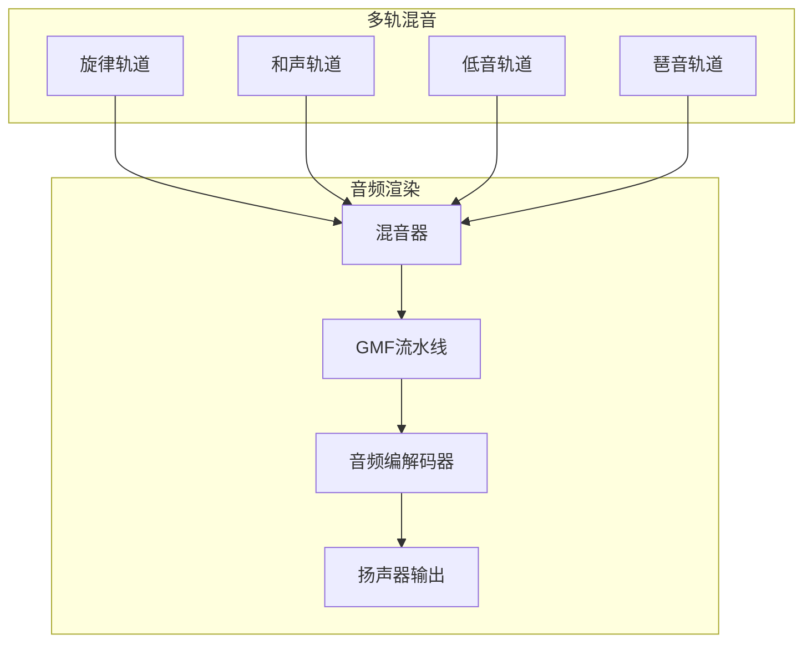

# 简单钢琴示例

- [English](./README.md)

本示例演示了使用 `esp_audio_render` 组件的完整**复音钢琴合成器**。它展示了高级音频生成、多轨音乐创作和实时音频渲染功能。

## 🎹 **演示的功能特性**

### **核心音频功能**
- **多轨音频渲染**：4个独立的音频流（旋律、和声、低音、琶音）
- **实时音频生成**：基于20ms块的平滑播放处理
- **流管理**：具有适当生命周期管理的独立流控制

### **高级钢琴合成**
- **丰富谐波的钢琴音色**：4谐波合成（基频 + 3个泛音）
- **ADSR包络**：专业的起音、衰减、持续、释音塑形
- **复音支持**：同时播放多个音符
- **八度音域**：支持2-7八度（C2到B7）
- **优化性能**：带插值的快速正弦查找表

### **音乐创作系统**
- **多轨作曲**：最多4个独立音乐轨道
- **基于音符的音乐**：具有持续时间的C、D、E、F、G、A、B音符系统
- **速度控制**：可配置的BPM和节拍持续时间
- **实时渲染**：动态音符生成和混音

### **实时钢琴控制**（可选功能）
- **交互式钢琴演奏**：启用 `SUPPORT_REALTIME_TRACK` 时可用
- **UART控制接口**：通过Python脚本进行实时钢琴控制
- **按键按下/释放事件**：自然的钢琴按键按下和释放行为
- **多八度支持**：C3-B3（低音）、C4-B4（中音）、C5-B5（高音）音域
- **现场演奏**：通过键盘输入实时演奏钢琴

## 🏗️ **架构概览**



## 🎵 **工作原理**

### **1. 音乐定义**
该示例定义了一首完整的歌曲（"小星星"），包含4个轨道：
- **轨道0（旋律）**：第4八度的主旋律
- **轨道1（和声）**：第3-4八度的和弦伴奏
- **轨道2（低音）**：第2八度的低音线条
- **轨道3（琶音）**：第4-5八度的分解和弦模式

### **2. 实时音符生成**
```c
// 以20ms块处理以获得平滑音频
const uint32_t chunk_duration_ms = 20;
uint32_t pcm_size = (sample_rate * chunk_duration_ms / 1000) * channels * 2;

// 为每个轨道独立生成音频
for (int track_idx = 0; track_idx < MAX_TRACKS; track_idx++) {
    // 为当前时间位置生成音符音频
    piano_tone_gen_note_from_offset(tone_gen, note, octave,
                                   chunk_duration_ms, buffer, buffer_size,
                                   note_elapsed, full_note_duration);
}
```

### **3. 实时音频渲染**
每个生成的轨道数据随后通过 `esp_audio_render_stream_write` 输入到音频渲染流中。

音频渲染器将混合所有轨道数据，最终通过编解码器设备输出。

### **4. 交互式钢琴控制**（启用SUPPORT_REALTIME_TRACK时）
启用实时钢琴功能时，系统可以接收UART命令进行现场钢琴演奏。

Python控制器（`piano_key.py`）提供：
- **终端输入**：无需root权限的原始键盘捕获
- **多八度支持**：不同按键范围对应不同八度

## 🚀 **运行示例**

### **硬件要求**
- **推荐**：[ESP32-S3-Korvo2](https://docs.espressif.com/projects/esp-adf/en/latest/design-guide/dev-boards/user-guide-esp32-s3-korvo-2.html) 或 [ESP32‑P4‑Function‑EV‑Board](https://docs.espressif.com/projects/esp-dev-kits/en/latest/esp32p4/esp32-p4-function-ev-board/user_guide.html)
- **音频输出**：内置扬声器或耳机插孔
- **其他开发板**：通过 `esp_gmf_app_setup_peripheral()` 支持

### **软件要求**
- ESP‑IDF v5.4 或更高版本
- `esp_audio_render` 组件
- ESP‑GMF 框架（格式转换器）
- `esp_codec_dev`（音频输出）

### **构建和烧录**
```bash
# 导航到示例目录
cd examples/simple_piano

# 构建和烧录
idf.py -p /dev/ttyUSB0 flash monitor
```

### **启用实时钢琴功能**（可选）
启用通过UART的交互式钢琴控制：

1. **在[piano_example.c](main/piano_example.c)中启用功能并重新构建**：
   ```c
   #define SUPPORT_REALTIME_TRACK
   ```

2. **使用Python控制器**（在另一个终端中）：
   ```bash
   # 安装依赖
   pip install pyserial
   
   # 运行钢琴控制器
   python3 piano_key.py --port /dev/ttyUSB0 --baud 115200
   ```

3. **实时钢琴演奏**：
   - **数字1-7**：C4-B4（中八度）
   - **字母Q-U**：C5-B5（高八度）
   - **ESC**：停止钢琴
   - **Ctrl+C**：退出控制器

## 🔧 **关键API使用**

### **钢琴音色生成**
```c
// 创建钢琴音色生成器
piano_tone_cfg_t cfg = {
    .sample_rate = 16000,
    .channels = 1,
    .bits_per_sample = 16,
    .attack_time = 0.01f,    // 10ms起音
    .decay_time = 0.05f,     // 50ms衰减
    .sustain_level = 0.7f,   // 70%持续
    .release_time = 0.1f     // 100ms释音
};
piano_tone_gen_create(&cfg, &tone_gen);

// 生成音符音频
piano_tone_gen_note_from_offset(tone_gen, NOTE_C, OCTAVE_4,
                               20, buffer, buffer_size,
                               elapsed_time, full_duration);
```

### **歌曲渲染**
```c
// 创建歌曲渲染器
song_cfg_t song_cfg = {
    .sample_rate = 16000,
    .channels = 1,
    .bits_per_sample = 16,
    .track_count = 4,
    .tempo = 120,              // 120 BPM
    .beat_duration_ms = 500    // 每拍500ms
};
song_render_create(&song_cfg, &song);

// 添加音乐轨道
song_render_add_track(song, 0, melody_notes, melody_octaves,
                     melody_durations, note_count);

// 开始播放
song_render_play(song, audio_render);
```

### **音频渲染集成**
```c
// 创建音频渲染器
esp_audio_render_create(&cfg, &audio_render);

// 打开多个流
esp_audio_render_stream_handle_t stream_handles[4];
for (int i = 0; i < 4; i++) {
   esp_audio_render_stream_get(render, ESP_AUDIO_RENDER_STREAM_ID(i), &stream_handles[i]);
}
esp_audio_render_stream_open(stream_handles[0], &input_info);  // 旋律
esp_audio_render_stream_open(stream_handles[1], &input_info);  // 和声
esp_audio_render_stream_open(stream_handles[2], &input_info);  // 低音
esp_audio_render_stream_open(stream_handles[3], &input_info);  // 琶音

// 持续写入音频数据
esp_audio_render_stream_handle_t current_stream = NULL;
esp_audio_render_stream_get(render->audio_render, ESP_AUDIO_RENDER_STREAM_ID(track->track_id), &current_stream);
esp_audio_render_stream_write(current_stream, pcm_buffer, pcm_size);
```

## 🎼 **音乐理论实现**

### **音符系统**
- **西方音阶**：C、D、E、F、G、A、B（Do、Re、Mi、Fa、Sol、La、Si）
- **频率计算**：`freq = base_freq * 2^(octave - 4)`
- **基础频率**：C4 = 261.63 Hz、D4 = 293.66 Hz 等

### **谐波合成**
在 `generate_piano_wave` 中实现

### **ADSR包络**
在 `calculate_adsr_envelope` 中实现

## 🎯 **使用场景**

### **教育应用**
- **音乐理论学习**：音符识别和频率关系
- **作曲练习**：多轨音乐创作
- **音频编程**：DSP和合成概念

### **产品开发**
- **音频反馈**：系统声音和通知
- **音乐播放器**：嵌入式音乐合成
- **交互式音频**：实时音频生成
- **现场音乐表演**：实时钢琴演奏和类MIDI控制

### **测试和验证**
- **音频流水线测试**：多流音频渲染
- **性能基准测试**：实时音频生成
- **格式转换**：GMF流水线验证

## 其他开发板支持

本示例可以利用 `gmf_app_utils` 进行快速开发板启动。在menuconfig的"GMF APP Configuration"下检查开发板兼容性。详情请参阅 `gmf_app_utils` README。

或者，您可以使用 [esp-bsp](https://github.com/espressif/esp-bsp/tree/master) API：
- 使用 `bsp_audio_codec_microphone_init()` 替代 `esp_gmf_app_get_record_handle()`

## 🤝 **贡献**

本示例展示了以下最佳实践：
- **音频合成**：高效的音色生成算法
- **多轨音频**：独立流管理
- **实时渲染**：基于块的音频处理
- **音乐创作**：结构化的基于音符的音乐系统

欢迎扩展此示例，添加更多功能或优化！
